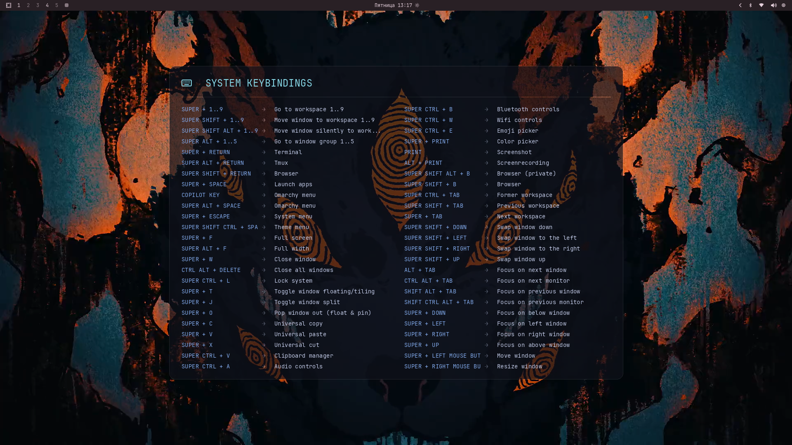

# Omarchy Keybindings Wallpaper

*Read this in other languages: [Русский](README.ru.md).*



A lightweight background daemon for the Omarchy Linux distribution (based on Hyprland) that automatically renders a system keybindings cheat sheet directly onto your active wallpaper inside a beautiful semi-transparent card.

---

## Features

1. **Dynamic Layout and Responsiveness:** 
   The script analyzes the number of unique bindings and automatically distributes them into a grid of 1 to 4 columns. The card is centered both vertically and horizontally on your screen.
2. **Smart Filtering and Compacting:**
   * Groups repetitive numerical shortcuts (e.g., workspace switches `SUPER + 1..9` are grouped into a single, compact line).
   * Excludes shortcuts for third-party applications and websites (Signal, Obsidian, WhatsApp, Docker, Email, etc.) to keep the layout clean and uncluttered.
   * Keeps only key system actions, plus Terminal and Web Browser launches.
   * The total list is capped at 50 shortcuts (which comfortably fits in 2 columns).
3. **Automatic Event-Driven Updates:**
   * Watches settings files in `~/.config/hypr/` and instantly redraws the wallpaper when you add or modify a binding.
   * Detects manual wallpaper changes or theme changes and applies the cheat sheet to the new background on the fly.
4. **System Integration:**
   * Runs as a standard systemd user service. Resource usage is extremely low (checks files every 3 seconds only).
   * Guarded against infinite recursive loops of self-writing the wallpaper.

---

## Requirements

To run this extension, you need:
* Python 3
* Pillow image library (`pip install Pillow`)
* JetBrains Mono Nerd Font (expected by default at `/usr/share/fonts/TTF/JetBrainsMonoNerdFont-Regular.ttf`)
* swaybg wallpaper utility (installed by default in Omarchy)

---

## Installation

You can install and start the extension with a single command:

```bash
git clone https://github.com/qirieshkaclwn/omarchy-bindings-wallpaper.git ~/.config/omarchy/extensions/bindings-wallpaper && mkdir -p ~/.config/systemd/user/ && ln -sf ~/.config/omarchy/extensions/bindings-wallpaper/omarchy-bindings-wallpaper.service ~/.config/systemd/user/ && systemctl --user daemon-reload && systemctl --user enable --now omarchy-bindings-wallpaper.service
```

Or install it as a native system package using `makepkg` (recommended for Arch Linux/Omarchy):

```bash
git clone https://github.com/qirieshkaclwn/omarchy-bindings-wallpaper.git && cd omarchy-bindings-wallpaper && makepkg -si
```

This builds and installs the package system-wide, registering the service template. Then start the service:

```bash
systemctl --user daemon-reload
systemctl --user enable --now omarchy-bindings-wallpaper.service
```

Or perform the installation steps manually for a local-only setup:

1. **Clone the repository** to the extensions directory:
   ```bash
   git clone https://github.com/qirieshkaclwn/omarchy-bindings-wallpaper.git ~/.config/omarchy/extensions/bindings-wallpaper
   ```

2. **Register the systemd service** by creating a symbolic link:
   ```bash
   mkdir -p ~/.config/systemd/user/
   ln -sf ~/.config/omarchy/extensions/bindings-wallpaper/omarchy-bindings-wallpaper.service ~/.config/systemd/user/
   ```

3. **Start the service**:
   ```bash
   systemctl --user daemon-reload
   systemctl --user enable --now omarchy-bindings-wallpaper.service
   ```

---

## Verification

You can verify the status of the running service with:
```bash
systemctl --user status omarchy-bindings-wallpaper.service
```

Any changes to `~/.config/hypr/bindings.conf` will now automatically show up on your wallpaper within 3 seconds!

---

## License

This project is licensed under the [MIT License](LICENSE).
